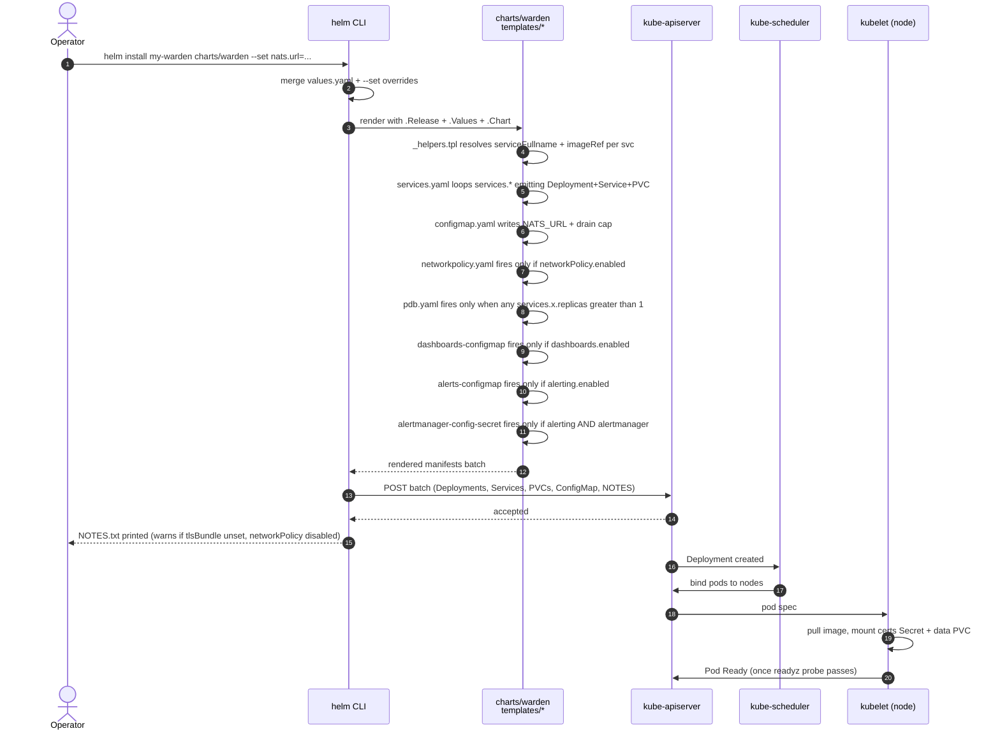
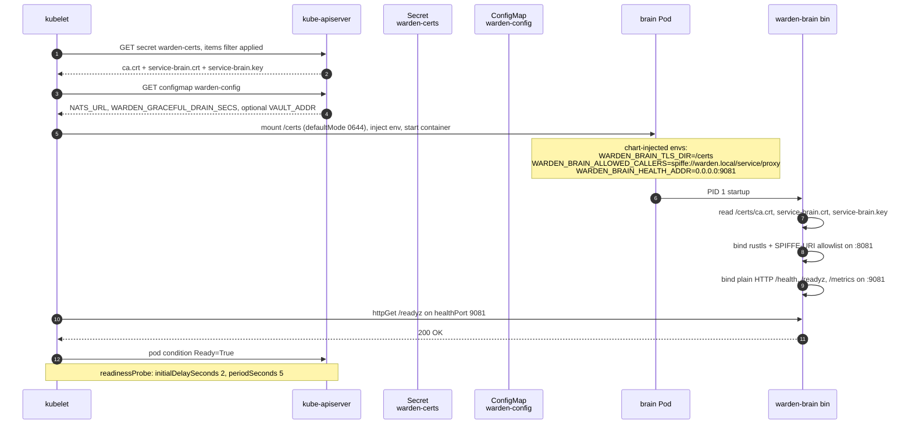
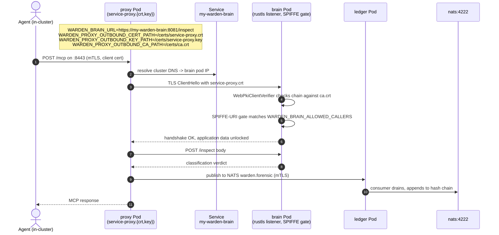
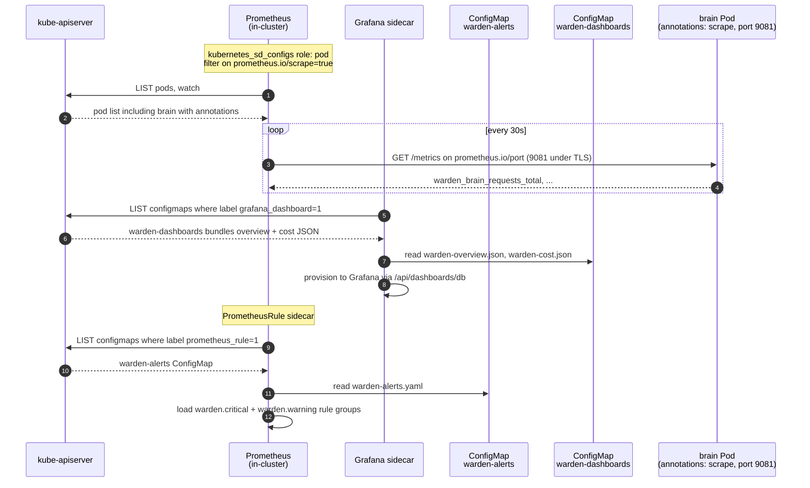
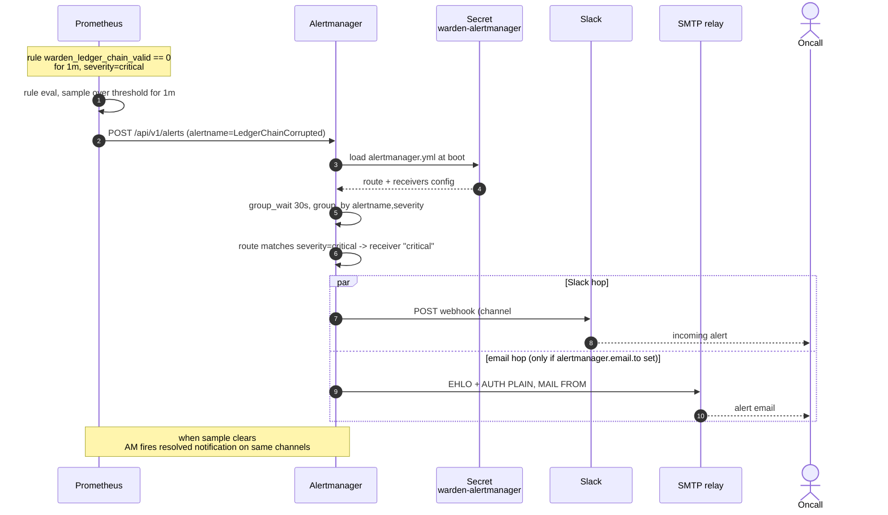
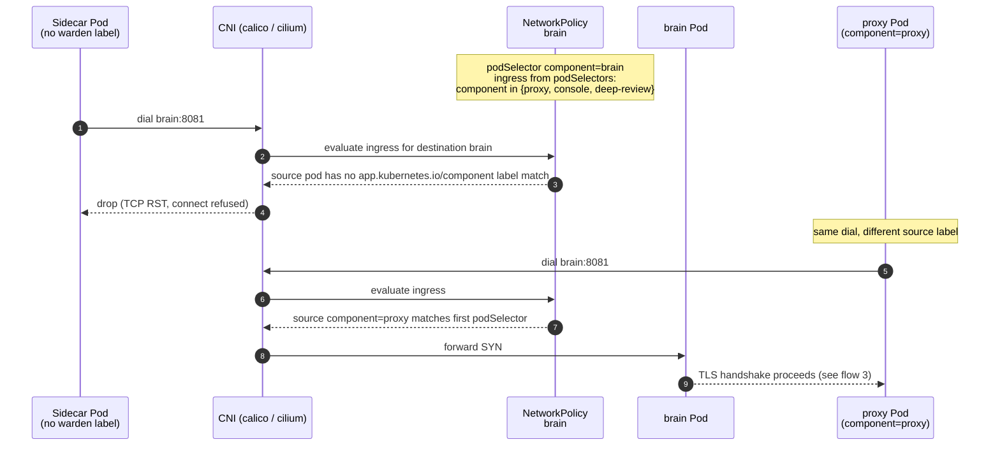
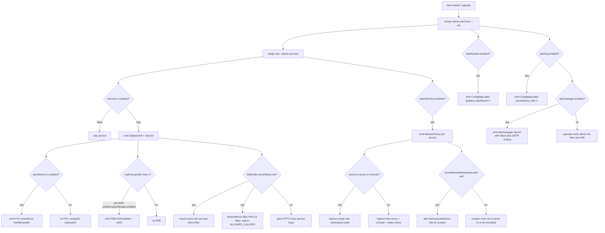

# warden-charts — sequence diagrams

Helm chart shape: eight Deployments + Services, optional NetworkPolicy
perimeter, optional PodDisruptionBudgets, optional TLS bundle Secret,
opt-in dashboards + alerts ConfigMaps, opt-in Alertmanager Secret. The
templates live under `charts/warden/templates/`; the values surface is
in `charts/warden/values.yaml`. Six flows below cover render + apply,
pod boot, cross-service URL wiring, observability discovery, alert
fan-out, and the NetworkPolicy ingress check — plus a flowchart of the
value-driven render-time branches.

## 1. `helm install <release> charts/warden`

Render is client-side (Helm 3) — the operator's kubectl context posts
the rendered batch straight to the apiserver; no Tiller. The eight
services + their PVCs are created in one apply round; kubelet reconciles
the schedule once the rendered Deployments land.

## 2. Pod boot under `tlsBundle.secretName` set

Each pod mounts only `ca.crt` + its own `service-<name>.{crt,key}` — the
Secret-items filter in `services.yaml:109-125` scopes the projection so
a compromised pod can't read another service's private key. Proxy also
mounts `server.{crt,key}` + `client.{crt,key}`. Under TLS mode brain /
policy / hil / identity / ledger move `/health` + `/readyz` + `/metrics`
to a plain-HTTP `healthPort` so kubelet probes and Prometheus scrapes
land without a client cert.

## 3. Cross-service backend URL wiring under `tlsBundle.secretName` set

`_helpers.tpl::warden.backendEnvs` flips every cross-service URL to
`https://` and injects `service-<caller>.{crt,key}` mount paths when
`tlsBundle.secretName` is non-empty. Proxy → brain is the canonical
hop; the same shape covers proxy → policy / hil / identity and console
→ ledger / hil / policy / identity.

## 4. Prometheus scrape + Grafana dashboard discovery

`warden.metricsAnnotations` writes `prometheus.io/scrape="true"` at the
pod level with a port fallback chain `metrics.port → healthPort → port`,
so under TLS the scrape lands on the plain-HTTP health listener. Rules
+ dashboards ship as ConfigMaps labelled `prometheus_rule:"1"` /
`grafana_dashboard:"1"` for the kube-prometheus-stack sidecar to pick up.

## 5. Alert fan-out — `LedgerChainCorrupted` fires

Severity-based routing splits critical vs. warning. `warden.critical`
matches against the `critical` receiver (Slack #warden-ops + email when
SMTP is configured); the default `slack-ops` receiver catches the rest.
The Secret form keeps webhook + SMTP creds off ConfigMaps.

## 6. NetworkPolicy perimeter — sidecar tries to reach `brain`

Front-door services (`proxy`, `console`) get `ingress: [{}]` so any pod
in the namespace can hit them; backends restrict to the three legitimate
in-stack callers. The Prometheus exception kicks in only when
`prometheusNamespaceLabel` is set — without that label the scrape lives
in the same namespace as warden and matches via the catch-all from
caller pods.

## Chart render decision tree

Every value-driven branch in the chart in one tree. The leaves are the
objects that actually land on the apiserver; the gates above them are
the values keys that decide whether they land.

